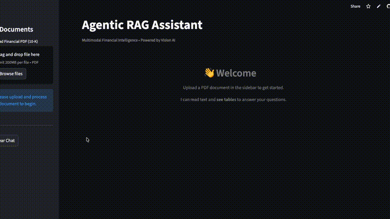

# 🔍 Visual-First Financial Document Intelligence Agent

> **Multimodal RAG system that uses Computer Vision + LLMs to analyze complex financial PDFs.**

 
[**🚀 Try it Live on Streamlit!**](https://mukundh0007-agentic-rag.streamlit.app/)

#### Demo Video:


[](https://www.python.org/downloads/)
[](https://streamlit.io)
[](https://llamaindex.ai)
[](https://www.docker.com/)


---

## 🎯 Problem Statement

Financial analysts spend **hours** manually cross-referencing data between narrative text and tables in 10-K filings. Traditional RAG fails because:

- OCR loses table structure.
- Charts and graphs are ignored.
- Context is lost between pages.

## 💡 Solution: The "Agentic" Approach

This is not just a chat bot. It is a **Visual Intelligence Pipeline**:

1. **Split-Screen Interface**: Read the original PDF while chatting with the AI.
2. **Vision-First Ingestion**: Uses **YOLOv8** to detect tables and **GPT-4o/Gemini** to "see" and summarize them.
3. **Visual Citations**: Every answer includes the **exact image** of the table used as source.
4. **Parallel Processing**: Ingests massive documents 5x faster using concurrent vision threads.

---

## 🚀 Quick Start (Local)

### 1. Prerequisites

- Python 3.12+
- `uv` (recommended) or `pip`
- OpenRouter API Key

### 2. Installation

```bash
git clone https://github.com/Mukundh0007/agentic-rag.git
cd agentic-rag

# Install dependencies
uv sync
```

### 3. Setup Models

Download the YOLOv8 weights and table detector (only once).

```bash
uv run python src/download_weights.py
```

### 4. Run the App

Launch the full product suite.

```bash
uv run python main.py --app
```

* **Login**: `admin` / `admin` (Demo Mode)
- **Workflow**: Upload PDF -> Click "Process" -> Chat.

---

## 🐳 Docker Deployment (Cloud Ready)

Run the entire application in a container with one command.

```bash
# Build
docker build -t agentic-rag .

# Run
docker run -p 8501:8501 -e OPENROUTER_API_KEY=your_key agentic-rag
```

Access at `http://localhost:8501`.

---

## 🏗️ Architecture

```
┌─────────────┐       ┌────────────────────┐
│  Upload PDF │──────►│  Vision Processor  │
└─────────────┘       │  (YOLOv8 + VLM)    │
                      └─────────┬──────────┘
                                │ Table Summaries
                                ▼
┌─────────────┐       ┌────────────────────┐
│   FastAPI   │◄──────│   Vector Index     │
│  Back-End   │       │  (LlamaIndex)      │
└─────────────┘       └────────────────────┘
       ▲
       │
┌─────────────┐
│  Streamlit  │
│  Frontend   │
└─────────────┘
```

## ✨ Key Features (V2)

- **Sidebar Admin**: Secure file management and processing status.
- **Dynamic Indexing**: Creates a fresh Knowledge Graph for every uploaded document.
- **Dark Mode Native**: Optimized for high-contrast professional environments.
- **Split View**: 50/50 Layout for Analyst productivity.

